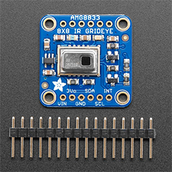
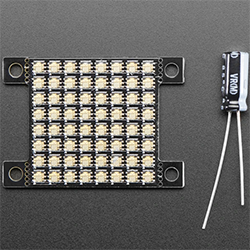
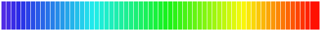

## AMG8833 code repo for Arduino, Adafruit Feather, Pycom Lopi4 and Raspberry Pi
### grideye_8x8

The repo is subdivided into four directories, one for each device. Each of the four directories contain useful URLs and brief guide to get the [AMG8833](https://www.adafruit.com/product/3538) sensor running along with example code.

Adafruit AMG8833 and DotStar 8x8:

 

To quickly and easily visualise the output of the sensor [Adafruit DotStar 8x8 LED matrix](https://www.adafruit.com/product/3444) was used. The main reason for using this LED matrix as opposed to and LCD screen was connectivity interfaces. AMG8833 uses an I2C interface (as do a lot of LCD displays for RPi/Arduino etc) and the LED matrix had an SPI interface that enabled cleaner and more effcient prototyping.

Lastly, using the LED matrix was a lot faster than just using a Serial.print() to check the latency on all of the tested devices.

### Code structure

Sketches are available for only AMG8833, DotStar matrix and AMG8833 and DotStar combined, as shown below:

`thermal_cam_init_testing`
`matrix_8x8_init_testing`
`combined_matrix_cam`

---

### Color range and the Processing sketch
`Processing/rgb_lerp` has RGB color codes to be pasted in Arduino/RPi/Feather/Lopy code to create a color pallete for the LED matrix.
The code is using linear interpolation between colors to create smooth transitions. The interpolation is done in HSB color space to have a broader range of colors and then is converted to RGB values and in the end we get the following output:

`...matrix.Color( 12 , 92 , 89 ),
 matrix.Color( 12 , 92 , 83 ),
 matrix.Color( 12 , 93 , 78 )...`

Then it can be pasted into the code as an array for the aforementioned devices.

#### Entire color scheme:

[More about Processing](https://processing.org/)

--- 

### gifs
#### Raspberry Pi: 

#### Arduino Uno:

#### Adafruit Feather: 

##### Lopy4:
 tested sensor only, no LED matrix test.

---

